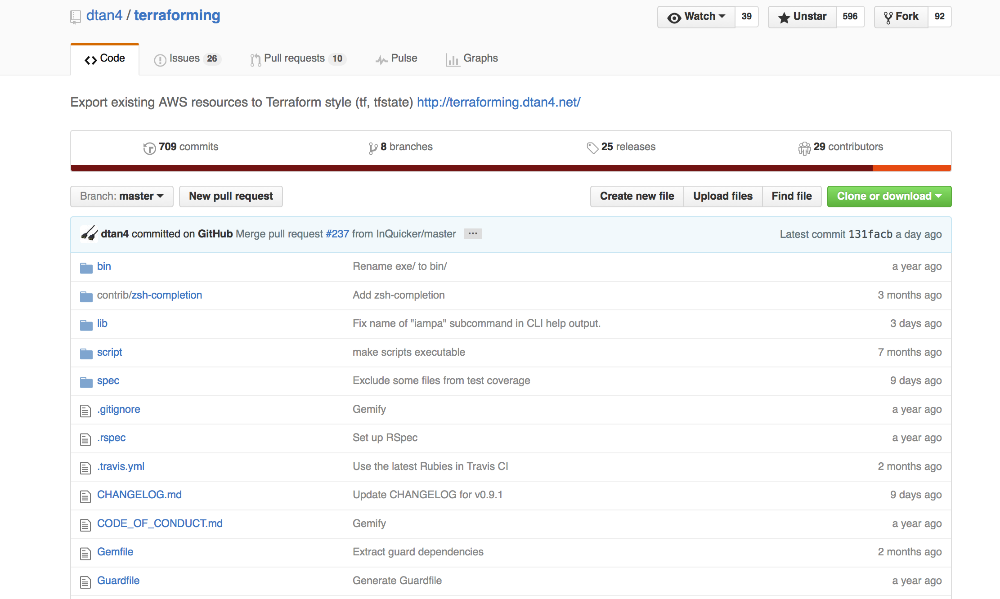

layout: true
class: center, middle

---
# 既存AWSリソースをTerraformの管理化にしてコード化する
## knakayama

---
# 自己紹介

---
# knakayama(中山 幸治)&nbsp;
## [http://knakayama.github.io](http://knakayama.github.io)

---
# クラスメソッド<br/>AWSコンサルティング部<br/>所属

---
# 今日の資料↓に置いときました
### [http://knakayama.github.io/LT-2016-06-30](http://knakayama.github.io/LT-2016-06-30)

---
# アジェンダ

---
layout: true
class: middle

---
### 1. Terraformについて
### 2. 既存AWSリソースをTerraformの管理下にする方法
### 3. コード化する上で考慮すべきポイント

---
layout: true
class: center, middle

---

# Terraformについて


---
layout: true
class: middle

---
# HashiCorp社を中心として開発されているOSSのインフラ構成ツール

---
layout: true
class: center, middle

---
<br/><br/>[https://github.com/hashicorp/terraform](https://github.com/hashicorp/terraform)

---
layout: true
class: middle

---
# インフラの「あるべき状態」をコード化できる

---
layout: false

<br/><br/><br/><br/>
```bash
$ cat compute.tf
<snip>
resource "aws_instance" "web" {
  ami                         = "${var.web_instance_ami_id}"
  instance_type               = "${var.web_instance_type}"
  vpc_security_group_ids      = ["${aws_security_group.web.id}"]
  subnet_id                   = "${aws_subnet.public.id}"
  key_name                    = "${aws_key_pair.site_key.key_name}"
  user_data                   = "${file("cloud-config.yml")}"
  associate_public_ip_address = true

  root_block_device {
    volume_type = "gp2"
    volume_size = 8
  }
  tags {
    Name = "${var.name}"
  }
}
<snip>
```
&nbsp;&nbsp;&nbsp;&nbsp;&nbsp;&nbsp;&nbsp;&nbsp;&nbsp;&nbsp;&nbsp;&nbsp;&nbsp;&nbsp;&nbsp;&nbsp;&nbsp;&nbsp;&nbsp;&nbsp;&nbsp;&nbsp;&nbsp;&nbsp;&nbsp;&nbsp;&nbsp;&nbsp;&nbsp;&nbsp;&nbsp;&nbsp;&nbsp;&nbsp;&nbsp;&nbsp;&nbsp;&nbsp;&nbsp;&nbsp;&nbsp;&nbsp;&nbsp;&nbsp;&nbsp;&nbsp;&nbsp;&nbsp;&nbsp;&nbsp;&nbsp;&nbsp;&nbsp;&nbsp;&nbsp;&nbsp;&nbsp;&nbsp;&nbsp;&nbsp;&nbsp;&nbsp;&nbsp;&nbsp;&nbsp;&nbsp;&nbsp;&nbsp;&nbsp;&nbsp;&nbsp;&nbsp;&nbsp;&nbsp;&nbsp;&nbsp;&nbsp;EC2インスタンスを作成する例

---
layout: true
class: middle

---
## インフラの「あるべき状態」-> `*.tf`
## インフラの「実際の状態」-> `*.tfstate`
## `*.tf` と `*.tfstate` の差分が変更点になる

---
layout: false

```json
$ cat terraform.tfstate
<snip>
"resources": {
    "aws_instance.web": {
        "type": "aws_instance",
        "depends_on": [
            "aws_key_pair.site_key",
            "aws_security_group.web",
            "aws_subnet.public"
        ],
        "primary": {
            "id": "i-75a9dbea",
            "attributes": {
                "ami": "ami-383c1956",
                "associate_public_ip_address": "true",
                "availability_zone": "ap-northeast-1a",
                "disable_api_termination": "false",
                "ebs_block_device.#": "0",
                "ebs_optimized": "false",
                "ephemeral_block_device.#": "0",
                "iam_instance_profile": "",
                "id": "i-75a9dbea",
                "instance_state": "running",
                "instance_type": "t2.micro",
                "key_name": "test",
                "monitoring": "false",
                "private_dns": "ip-172-16-0-192.ap-northeast-1.compute.internal",
                "private_ip": "172.16.0.192",
                "public_dns": "ec2-54-238-149-223.ap-northeast-1.compute.amazonaws.com",
<snip>
```
&nbsp;&nbsp;&nbsp;&nbsp;&nbsp;&nbsp;&nbsp;&nbsp;&nbsp;&nbsp;&nbsp;&nbsp;&nbsp;&nbsp;&nbsp;&nbsp;&nbsp;&nbsp;&nbsp;&nbsp;&nbsp;&nbsp;&nbsp;&nbsp;&nbsp;&nbsp;&nbsp;&nbsp;&nbsp;&nbsp;&nbsp;&nbsp;&nbsp;&nbsp;&nbsp;&nbsp;&nbsp;&nbsp;&nbsp;&nbsp;&nbsp;&nbsp;&nbsp;&nbsp;&nbsp;&nbsp;&nbsp;&nbsp;&nbsp;&nbsp;&nbsp;&nbsp;&nbsp;&nbsp;&nbsp;&nbsp;&nbsp;&nbsp;&nbsp;&nbsp;&nbsp;&nbsp;&nbsp;&nbsp;&nbsp;&nbsp;&nbsp;&nbsp;&nbsp;&nbsp;&nbsp;&nbsp;&nbsp;&nbsp;&nbsp;&nbsp;&nbsp;&nbsp;&nbsp;&nbsp;&nbsp;&nbsp;&nbsp;&nbsp;&nbsp;EC2インスタンスの状態

---
layout: true
class: center, middle

---
# ターミナルで作業完結できる

---
layout: false

&nbsp;&nbsp;&nbsp;1. 変更の差分を確認
```bash
$ terraform plan
<snip>
+ aws_instance.web
    ami:                                       "" => "ami-383c1956"
    associate_public_ip_address:               "" => "true"
    availability_zone:                         "" => "<computed>"
    ebs_block_device.#:                        "" => "<computed>"
    ephemeral_block_device.#:                  "" => "<computed>"
    instance_state:                            "" => "<computed>"
    instance_type:                             "" => "t2.micro"
<snip>
Plan: 9 to add, 0 to change, 0 to destroy.
```

&nbsp;&nbsp;&nbsp;2. 実行
```bash
$ terraform apply
<snip>
aws_instance.web: Creating...
  ami:                                       "" => "ami-383c1956"
  associate_public_ip_address:               "" => "true"
  availability_zone:                         "" => "<computed>"
  ebs_block_device.#:                        "" => "<computed>"
  ephemeral_block_device.#:                  "" => "<computed>"
  instance_state:                            "" => "<computed>"
  instance_type:                             "" => "t2.micro"
<snip>
Outputs:

  web_public_ip = 54.238.149.223
```

---
layout: true
class: middle

---
# 主要IaaS/PaaS/SaaSに対応
# 基本AWS使って一部GCP使う<br/>という構成も可能

---
layout: true
class: center, middle

---
<br/><br/>[https://www.terraform.io/docs/providers/](https://www.terraform.io/docs/providers/)&nbsp;(もっといっぱいある)

---
# Demo
### TerraformでEC2インスタンス作ってみる

---
構成図<br/><br/>

---
# 2. 既存AWSリソースを<br/>Terraformの管理下に<br/>する方法

---
layout: true
class: middle

---
## 既存リソースから `*.tf` と `*.tfstate` を作成する必要がある
## 現在主に2つの方法がある

---
## 1. terraforming
## 2. Terraformのimport機能

---
layout: true
class: center, middle

---
# 1. terraforming

---
<br/><br/>[https://github.com/dtan4/terraforming](https://github.com/dtan4/terraforming)

---
layout: true
class: middle

---
### 既存リソースから `*.tf` と `*.tfstate` を作成可能
### Ruby製
### AWSサービス単位(VPCなど)で作成
### 特定リソース(vpc-xxxのVPC)のみ作成することは不可
### `*.tfstate` の操作が細かく制御可能(merge/overwrite)

---
layout: false

&nbsp;&nbsp;&nbsp;`*.tf` の作成
```bash
$ terraforming ec2 --region ap-northeast-1
resource "aws_instance" "simple" {
    ami                         = "ami-383c1956"
    availability_zone           = "ap-northeast-1a"
    ebs_optimized               = false
    instance_type               = "t2.micro"
    monitoring                  = false
    key_name                    = "test"
<snip>
```

&nbsp;&nbsp;&nbsp;`*.tfstate` の作成
```json
$ terraforming ec2 --tfstate --region ap-northeast-1
<snip>
"resources": {
  "aws_instance.simple": {
    "type": "aws_instance",
    "primary": {
      "id": "i-75a9dbea",
      "attributes": {
        "ami": "ami-383c1956",
        "associate_public_ip_address": "true",
        "availability_zone": "ap-northeast-1a",
        "ebs_block_device.#": "0",
        "ebs_optimized": "false",
        "ephemeral_block_device.#": "0",
        "id": "i-75a9dbea",
<snip>
```

---
layout: true
class: center, middle

---
# Demo
### terraformingを使ってみる

---
# 2. Terraformのimport機能

---
layout: true
class: middle

---
### 既存リソースをTerraformに取り込む(import)機能
### v0.7.0で導入予定(まだv0.7.0出てない@2016/06/30)
### まだ `*.tfstate` のimportしか対応してない
### 特定リソース(vpc-xxxのVPC)単位でimport可能
### merge/overwriteのような操作は現時点では未対応
### 細かい操作は `state` コマンドで `*.tfstate` 修正する必要あり
### まだまだ発展途上だが今後機能が拡充されていく予定

---
layout: false

&nbsp;&nbsp;&nbsp;`*.tfstate` のimport
```bash
$ $GOPATH/bin/terraform import aws_instance.web i-75a9dbea
<snip>
aws_instance.web: Importing from ID "i-75a9dbea"...
aws_instance.web: Import complete!
  Imported aws_instance (ID: i-75a9dbea)
aws_instance.web: Refreshing state... (ID: i-75a9dbea)

Import success! The resources imported are shown above. These are
now in your Terraform state. Import does not currently generate
configuration, so you must do this next. If you do not create configuration
for the above resources, then the next `terraform plan` will mark
them for destruction.
```

&nbsp;&nbsp;&nbsp;`*.tfstate` の中身
```json
$ cat terraform.tfstate
<snip>
"resources": {
    "aws_instance.web": {
        "type": "aws_instance",
        "primary": {
            "id": "i-75a9dbea",
            "attributes": {
                "ami": "ami-383c1956",
                "availability_zone": "ap-northeast-1a",
                "disable_api_termination": "false",
                "ebs_block_device.#": "0",
<snip>
```

---
layout: true
class: center, middle

---
# Demo
### Terraformのimport機能使ってみる

---
layout: true
class: center, middle

---
# 3. コード化する上で<br/>考慮すべきポイント

---
layout: true
class: middle

---
## 1. 既存リソースのコード化について
## 2. インフラのコード化そのものについて

---
layout: true
class: center, middle

---
# 1. 既存リソースの<br/>コード化について

---
layout: true
class: middle

---
### 既存リソースをTerraform化する方法はまだ発展途上
### コマンド一発でまるっと取り込むはできない
### ほぼ確実に `*.tf` と `*.tfstate` を手動で編集する必要がある
### 社会は甘くない

---
layout: true
class: center, middle

---
# 2. コード化そのもの<br/>について

---
layout: true
class: middle

---
### 全てコード化されていることが最適な訳ではない
### 緊急に対応する必要がある場合(障害対応)AMCの方が早い
### 運用で変更する可能性が高いものは別の管理方法を導入する
### コード化するメリット(変更履歴/開発フロー)の見極めが必要

---
layout: true
class: center, middle

---
<br/><br/>[http://blog.stormcat.io/entry/selective-terraform-operation](http://blog.stormcat.io/entry/selective-terraform-operation)

---
# ベストプラクティスを模索中

---
background-image: url(http://img.laughy.jp/6483/default_0613a3bc790c703d04177aa6db0153ac.jpg)

---
background-image: url(http://img.laughy.jp/6483/default_0613a3bc790c703d04177aa6db0153ac.jpg)
# **Terraform先生の<br/>今後にご期待ください**
